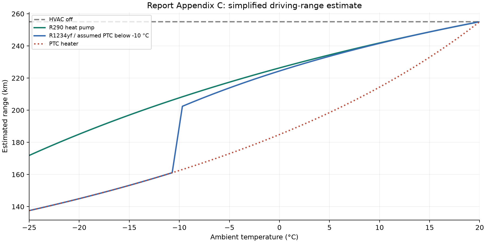
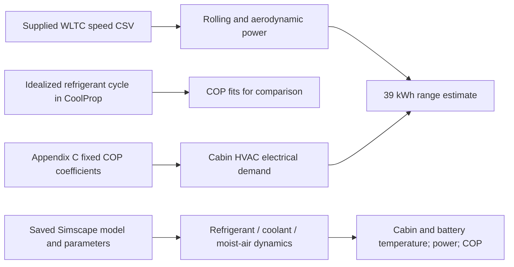

# PFAS-Free Heat Pumps for Electric Vehicles

An engineering study of how refrigerant choice and thermal control affect winter cabin heating, battery conditioning, and estimated EV range.

This DENSYS master's case based module compares propane (R290) with R1234yf using a
simplified Python range analysis and a separate MATLAB/Simulink/Simscape thermal
model. The vehicle context is the Hyundai Inster Standard Range; the modeled
architecture combines direct refrigerant-to-cabin heating with indirect
coolant-to-battery heating.

**Reproducibility status:** the Python analysis has been reconstructed from the
final report, executed, and checked. The supplied Simscape snapshots have been
inspected but have **not** been rerun successfully. This is an academic simulation
study, not a validated vehicle design or a certified refrigerant conversion.



*Executed reconstruction of final-report Appendix C. The R1234yf-to-PTC transition
below −10 °C is an imposed assumption. The curves are estimates, not road-test data.*

## Engineering problem

Electric vehicles must allocate stored electrical energy to propulsion and
thermal conditioning. In cold weather, cabin heating increases auxiliary demand.
The project investigates a non-fluorinated refrigerant candidate and examines
the trade-off between heating performance, control behavior, and implementation
constraints. Propane's flammability remains an unresolved design consideration;
the modeled direct cabin heat exchanger does not demonstrate a production safety
solution. Regulatory statements in the academic sources describe their study
context and are not presented here as current legal conclusions.

## Technical approach



The Python fit is not automatically injected into the range model, and neither
Python output feeds the saved Simscape models. Their conclusions must be compared
with their different boundaries and assumptions in view.

The range calculation uses:

$$P_\mathrm{traction}=\frac{(mgC_\mathrm{rr}+\tfrac12\rho A C_dv^2)v}{\eta}$$
$$\dot Q_\mathrm{cabin}=\max[0,H(T_\mathrm{target}-T_\mathrm{amb})],\qquad
P_\mathrm{HVAC}=\dot Q_\mathrm{cabin}/\mathrm{COP}$$
$$R=\frac{E_\mathrm{battery}}{\overline P_\mathrm{traction}+P_\mathrm{aux}+P_\mathrm{HVAC}}\,\overline v$$

The last equation requires consistent kWh, kW, hours, and km/h. Acceleration
energy and regenerative braking are absent from the supplied Appendix C logic.
For simulation postprocessing, the original MATLAB helper computes
$\mathrm{COP}_E=\int\dot Q_\mathrm{useful}dt/\int P_\mathrm{in}dt$;
this differs from averaging instantaneous COP.

See [technical summary](docs/technical-summary.md) for the system model,
assumptions, units, control loops, and distinctions between source claims and
code evidence.

## Executed results

The following values come from the executed Appendix C reconstruction and the
supplied CSV. R1234yf operates in the **assumed PTC mode** at these temperatures.

| Ambient temperature | R290 estimated range | R1234yf/PTC estimated range | Relative difference |
|---|---:|---:|---:|
| −25 °C | 171.855 km | 137.536 km | +24.953% |
| −20 °C | 185.105 km | 144.957 km | +27.697% |
| −15 °C | 196.993 km | 153.224 km | +28.566% |

The HVAC-off baseline is **255.045 km**. The speed input contains **1,801 samples**
over an index-based **1,800 s** time axis, with mean speed **46.499 km/h**.
Its speeds exactly match the supplied workbook's Class 3 version 5 preliminary
validation trace; equivalence to a current homologation cycle was not established.
These numbers demonstrate execution of the reported method, not experimental
validation or a measured improvement to an actual vehicle.

Some entries in the report's range table do not reproduce: at −10 °C, Appendix C
gives **201.629 km** for R1234yf, whereas Table 5 lists **189 km**. The
[verification report](docs/verification.md) gives the full comparison. Simscape
COP values remain report-sourced and are not included here as executed results.

## Repository contents

```text
src/python/          Reconstructed report analysis and command-line runner
src/matlab/          Isolated model runner and checked COP postprocessor
data/raw/            Original speed CSV and provenance notes
docs/                Audit, engineering summary, workflow, issues and portfolio
docs/verification/   Curated outputs from the executed Python workflow
tests/               Python checks and an unexecuted MATLAB synthetic test
models/              Instructions and locally held academic model snapshots
results/             New generated runs, ignored by Git
_private/            Local reports, original exports and complete audit evidence
```

[Copy mapping and final structure](docs/repository-structure.md) ·
[File inventory and audit](docs/audit.md) · [Known issues](docs/issues.md)

## Python setup and execution

Tested with **Python 3.12.14** on Windows. Exact direct dependencies are pinned
in [requirements.txt](requirements.txt). Original project package versions were
not supplied; these are the versions used for the reconstruction.

```powershell
python -m venv .venv
.\.venv\Scripts\python.exe -m pip install -r requirements.txt
.\.venv\Scripts\python.exe src/python/run_analysis.py
.\.venv\Scripts\python.exe -m unittest discover -s tests -v
```

On macOS/Linux, use `.venv/bin/python` after creating the environment. Run from
the repository root, or pass an explicit path to the runner. The default input
is resolved relative to the script rather than the current directory.

The runner creates `results/python-report-reproduction/`, containing range and
COP CSVs, three labeled PNG figures, and a JSON record of versions and results.
It refuses to overwrite a previous run. For another run:

```powershell
.\.venv\Scripts\python.exe src/python/run_analysis.py --output results/run-02
```

Use `--cycle PATH` for an explicitly selected compatible input, or
`--skip-property-fit` to run only the speed and range analysis. An alternative
dataset changes the experiment and must be identified in any reported results.

## MATLAB setup and execution

For the organized file layout and upload checklist, start with the
[MATLAB file guide](docs/matlab-file-guide.md). MATLAB simulation is not required
for this repository-preparation handoff; the commands below are optional future
execution instructions, not evidence of a successful run.

The source parameter headers identify **MATLAB R2025a Update 1**. The principal
requirements are MATLAB, Simulink, Simscape, and Simscape Fluids. The tuning
snapshot contains MATLAB Function blocks; confirm any additional Stateflow
requirement using the installed release. Toolbox availability was not verified
because the preparation-time batch session did not finish startup.

The local working folder includes three original snapshots. They are excluded
from Git pending publication review; a public clone needs the approved model
files supplied separately as described in [models/README.md](models/README.md).

```matlab
addpath('src/matlab')
info = run_project("r290_tuning", "inspect");
% Review the saved configuration before requesting a simulation:
result = run_project("r290_tuning", "simulate");
```

This runs the selected snapshot **as saved**, not all report scenarios. It
copies the model into a fresh results directory and leaves original files
intact. Do not use `addpath(genpath(...))` on the source archive: duplicated
model names can resolve to the wrong variant. The R1234yf parameter script
omits `battery_T_init`; its simulation is deliberately blocked until the
intended value is established. No missing physical value is silently supplied.

For saved heat/power signals with confirmed seconds and watts:

```matlab
cop = calculate_saved_cop("path/to/Qusefull.mat", "path/to/P_el.mat");
runtests('tests/test_saved_cop.m')
```

MATLAB execution instructions and the new MATLAB code are **unverified at
runtime**. See [workflow](docs/workflow.md) for legacy helper limitations and
the steps needed to recover the full scenario matrix.

## Inputs, outputs, and boundaries

| Quantity | Units | Use |
|---|---|---|
| Speed CSV | km/h; row index interpreted as seconds | Python range and profile analysis |
| Ambient/cabin temperature | °C; temperature differences in K | Heating demand and controls |
| Usable battery energy | 39 kWh | Python range estimate only |
| Cabin heat-loss coefficient | 135 W/K | Python steady-state cabin load |
| Auxiliary electrical load | 1,500 W | Python constant baseline |
| Refrigerant state | K, Pa, J/kg in CoolProp | Appendix B property calculation |
| MATLAB signals | Block-defined; commonly °C, MPa, W, rpm | Simscape thermal/control model |
| COP | dimensionless | Definition depends on cycle, time-series or energy boundary |

## Limitations and next engineering steps

- Restore the exact MATLAB configurations and paired raw outputs behind all
  eight refrigerant/ambient/speed cases before claiming full reproduction.
- Resolve conflicting report coefficients, switch thresholds, table values,
  and the distinction between instantaneous COP and integrated COP.
- Evaluate propane safety architecture and charge before any physical design
  recommendation. No leakage, crash, ignition, or certification study is supplied.
- Proposed additions such as acceleration, regenerative braking, calibrated
  controls, defrost, battery derating, and uncertainty analysis would change
  the methodology and require an explicitly documented new experiment.

## Academic context and contribution

DENSYS 2.0, Université de Lorraine, first-semester Case Base Module,
academic year 2025–2026. Final report dated 5 February 2026:
*Modeling PFAS-Free Refrigerants in Heat Pumps for EV Applications*.

Report authors: A. Aziz, A. E. Güngör, A. Hodžić, and V. Van Scyoc Hernandez.
Supervisor: Chrisle Joseph Charls. The presentation uses “M. A. Aziz”; the
preferred citation spelling requires author confirmation.

**Portfolio owner:** [confirm name]. **Personal contribution:** [confirm which
modeling, programming, control, analysis, and writing tasks were yours].
The repository preparation adds documentation, Python transcriptions, wrappers,
and checks; it does not imply sole authorship of the original team study.

## Citation, attribution, and license status

Use [CITATION.cff](CITATION.cff) for the supplied report metadata. The adapted
Simscape work originates from MathWorks' [Electric Vehicle Thermal Management
with Heat Pump example](https://www.mathworks.com/help/hydro/ug/ElectricVehicleThermalManagementWithHeatPump.html).
See [third-party notices](THIRD_PARTY_NOTICES.md) for the separate driving-cycle
license and source attribution.

Original project code and accompanying repository documentation are licensed
under the [MIT License](LICENSE), as selected by the project owner. This does
not relicense third-party code, adapted MathWorks models, externally sourced
datasets, or the original academic reports and figures. Their existing terms
and publication permissions remain separate; see [scope and exclusions](THIRD_PARTY_NOTICES.md).
Reports and raw models remain held locally pending review.
No remote repository has been created and nothing has been published.

## Portfolio and contact

[Portfolio project summary, CV bullet, and LinkedIn description](docs/portfolio.md)

Name: [confirm] · GitHub: [add profile] · Portfolio: [add URL] · Contact: [add preferred public contact]
